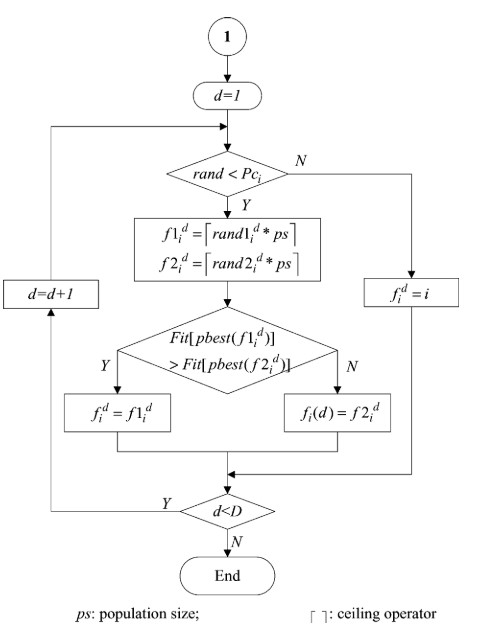
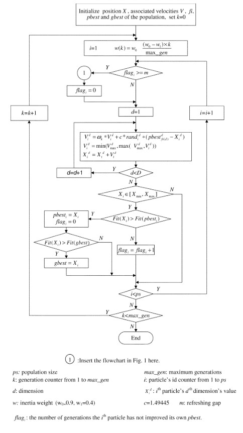
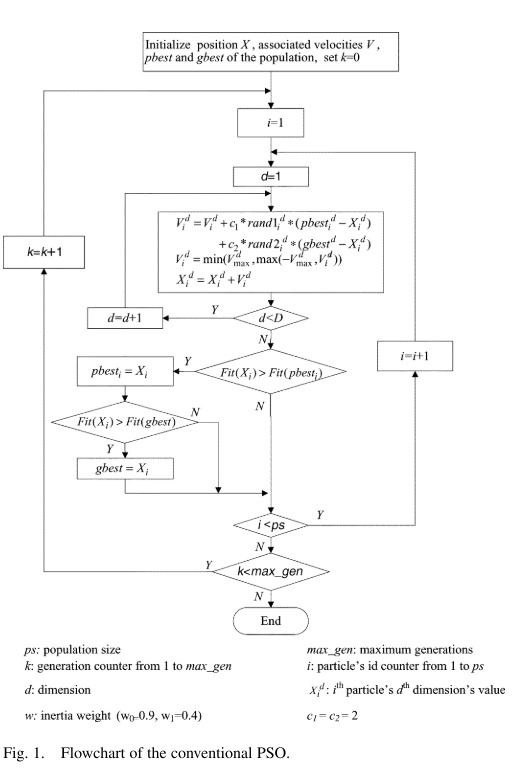

# 综合学习粒子群优化算法

本文介绍了一种综合学习的粒子群优化算法，该算法的提出是为了使得粒子群优化在处理多模态问题（即多峰问题）上能够避免算法落入局部最优的风险。文章参考自JJ Liang，AK Qin，PN Suganthan，S Baskar所写的《**Comprehensive learning particle swarm optimizer for global optimization of multimodal functions**》

## 1 摘要

本文介绍的综合学习粒子群优化算法 (**CLPSO**)是粒子群优化算法 (**PSO**) 的一种变体，它使用一种新颖的学习策略，即使用所有其他粒子的历史最佳信息来更新粒子的速度。 这种策略可以保持群的多样性，以防止过早收敛。 对多模态测试函数（多峰函数）及组合函数进行了相关的测试。 结果表明，与 $PSO$ 的其他最新变体算法相比，$CLPSO$ 在解决多模态问题方面具有良好的性能。

## 2 算法介绍

在经典的 $PSO$ 算法中，每个粒子的更新都是同时受到 $pbest$ 及 $gbest$ 的影响。同时由于整个种群粒子速度的更新都会受到 $gbest$ 的影响，因此会使得在经典 $PSO$ 算法中算法收敛速度较快。

但是这就像是一把双刃剑，收敛过快在经典的 $PSO$ 算法中会产生一个问题，即求解多模态（多峰问题）问题时当一个全局历史最优粒子陷入局部最优，$gbest$ 将会吸引其他粒子陷入该区域，并无法自拔。这将会导致算法无法寻找到全局最优解。

然而在经典的 $PSO$ 中一个粒子的适应度的值是通过粒子的所有维度决定的，然而一个粒子在某些维度上发现了与全局最优对应的区域，可能会因为其他维度的解决方案不佳而具有较低的适应度值。为了解决该问题，文献[2]提出使用所有粒子的 $pbest$ 用于更新任何一个粒子的速度，这种新颖的策略确保了群体的多样性，以防止过早收敛。之后在文献[1]，即本文主要参考文献，讨论并展示了使用综合学习策略的三个版本的 $PSO$，与 $PSO$ 的其他几个变体相比，在解决多模态问题方面的性能显着提高。 根据结果，在三个变体中，$CLPSO$ 是最好的。 因此，在文献[1]中进一步研究了 $CLPSO$。

### 2.1 综合学习策略

在 $CLPSO$ 中，主要特征就是广泛学习策略，该策略给予该算法更好的多模态求解能力，该策略改进的速度更新公式为：
$$
v_i^d=\omega v_i^d+c*rand_i^d*(pBest_{f_i(d)}^d-x_i^d)\tag{1}
$$

从公式(1)来看，广泛学习策略的速度更新公式相较于经典粒子群优化算法缺少了全局最优对粒子的引导，只有一个 $pBest_{f_i(d)}^d$ 对粒子的引导。因此，理解 $pBest_{f_i(d)}^d$ 便是理解广泛学习策略甚至于 $CLPSO$ 的关键所在。

首先要明确的是，$pBest_{f_i(d)}^d$ 不是所更新速度粒子的历史最优的第 $i$ 个维度，而是根据相应法则从所有粒子的历史最优位置（包括自己）中挑选出来的。整体分为两个大部分：

在粒子 $i$ 速度的第 $d$ 维更新时是选择自己的 $pBest_i$ 的相应维度进行更新还是其他粒子的历史最优位置的相应维度。在该文中，作者通过一个随机概率 $Pc_i$ 来进行判定，判定的实施如下所示：
$$
pBest_{f_i(d)}^d=\begin{cases}
    pBest_i^d; & if\quad rand_i^d>Pc_i\\
    pBest_x^d; & otherwise
\end{cases}\tag{2}
$$
在上式 $x=1,2,...,N;x\not ={i}$，用中文描述，即当产生的随机数大于概率 $Pc_i$ 时，则使用粒子自身的历史最优位置的第 $d$ 维 $pBest_i^d$ 进行更新。从这个角度来看，规则除了写成公式(2)形式还可以写成公式(3)形式。
$$
f_i(d)=\begin{cases}
    i,&if\quad rand_i^d>Pc_i\\
    x,&otherwise
\end{cases}\tag{3}
$$
此时公式(1)便可写成下式：
$$
v_i^d=\omega v_i^d+c*rand_i^d*(pBest_i^d-x_i^d)\tag{4}
$$

当 $rand_i^d \not >Pc_i$ 时，也就是 $f_i(d)$ 取值为 $x$，而 $x$ 的取值还待确定，关于 $x$ 的确定，在文中作者提出了一种**竞技选择过程(Tournament Selection Procedure)**

### 2.2 竞技选择过程

在 $x$ 的选择上按照如下程序进行：

   1. 首先随机在 $x$ 的取值范围内随机选择两个粒子的历史最优位置。即除却当前要更新速度的粒子之外的其他粒子的历史最优位置。
   2. 在随机选择的两个粒子中比较两个粒子的历史最优位置的适应值，选择适应值更优越的历史最优位置作为此时的 $pBest_x^d$ ，以此进行速度的更新。此时更新公式可写成式(5)。
   3. 当出现极端情况：某个粒子更新速度所有的维度都是使用的自身历史最优位置的对应维度进行更新，则随机选择一个维度来学习另一个粒子的历史最优对应维度。

$$
    v_i^d=\omega v_i^d+c*rand_i^d*(pBest_x^d-x_i^d)\tag{5}
$$

   >这里稍微进行补充:
   >
   >- 第一点：我们在进行函数求解时，适应值一般是用是否更优越来描述，而不是大小描述，这是由于对于求解的问题不一样，评判标准不一样。当求解函数最大值时，则适应度越大越优越；当求解的问题是求解最小值时，适应度越小越优越。因此在以往的描述中，一般都是使用适应值的优越程度，而不使用适应值大小之类的次，以免造成误解。
   >- 第二点：上面第三个过程在文献[1]中并未提及如何选择另一个粒子，这里就暂定从除更新粒子外的其他粒子中的随机选择一个粒子。

>上图是作者论文中描述的竞技选择过程流程图，但是在其中存在一个问题，那便是对论文中第三个要点图中并未体现，也并未注明。由此，图与文便产生了冲突。具体如何处理，我会在最后进行相关性说明。

### 2.3 CLPSO 与 经典 PSO 区别

在作者的实验过程中，发现了 CLPSO 与 经典 PSO 有三个主要区别：

 1. 经典PSO的粒子学习对象来自自身历史最优位置及全局历史最优。在CLPSO中任意一个粒子的历史最优位置都有可能成为学习对象，引导粒子的飞行方向。
 2. 与从所有维度的相同粒子的 $pBest$ 学习的经典 $PSO$ 不同，粒子的每个维度通常可以从一代甚至于几代相同维度的不同 $pBest$ 中学习。 换句话说，一个粒子的每个维度都可以从不同粒子的 $pBest$ 的对应维度中学习。
 3. 与经典 $PSO$ 中的每一代同时从两个样本（$pBest$ 和 $gBest$）学习不同，$CLPSO$ 粒子的每个维度只从一个样本学习几代。

### 2.4 CLPSO 的搜索行为

在文献[1]中，作者提出广泛学习策略能够增加种群的多样性，同时能提高算法在多模态(多峰)问题的求解能力。
此外提出经典 $PSO$ 存在振荡问题。具体描述如下图：

其主要出发点在于当多个历史最优值在同一维度线上，或者直接看成上图的直线，且粒子在 $pBest$ 和 $gBest$ 中间，那么该粒子在迭代更新时便会受到左右两边的历史最优的同时拉扯，从而出现振荡现象。
>下面仅为个人观点：个人觉得振荡有更大的可能发生在 $CLPSO$ 中，而非经典 $PSO$ ，正如文献[1]提供的图，有两者在中间拉扯，但是在每次运行中历史最优都会被更新，倘若该粒子这次被 $gBest$ 拉扯到偏向 $gBest$ 位置，如果该位置优于该粒子的历史最优位置，那么就会更新。所以虽然可能出现在中间的情形，但一定会偏向一边移动。而由于 $CLPSO$ 只有一个学习对象 $pBest_{f_i(d)}^d$，当这个学习对象在广泛学习过程中得到的位置在整体上总是劣与该粒子，那么就会出现该粒子一直在比当前粒子历史最优更差的区域不停的游荡。

作者还提出，即使在远离全局最优的局部最优区域中，$gbest$ 也可能影响粒子沿其方向移动。 如果 $pbest$ 和 $gbest$ 在粒子当前位置的同一侧，并且指向局部最优，则粒子将朝那个方向移动，一旦 $pbest$ 落入相同的位置，粒子可能无法跳出局部最优区域。 $gbest$ 所在的局部最优区域。然而，在广泛学习策略中，当粒子的 $pbest$ 和 $gbest$ 落入相同的局部最优区域时，粒子可以通过学习其他粒子的 $pbest$ 向其他方向飞行。 因此，广泛学习策略能够通过整个群体的合作行为跳出局部最优。

### 2.5 学习概率 $Pc_i$

由于在文献 [2] 的测试中中，作者发现如果对群体中的所有粒子使用相同的 $Pc$ 值，不同的 $Pc$ 值会在同一问题上产生不同的结果。 在非旋转的问题上，较小的值表现更好，而在旋转的问题上，不同的 $Pc$ 对不同的问题产生最佳性能。 不同的 $Pc$ 值在简单的单峰问题上产生相似的结果，同时严重影响 $CLPSO$ 在多峰问题上的性能。

>至于该文对旋转及非旋转问题的定义文中未能提及，本人才疏学浅，无力解释，便对该问题不多言。但是这个问题对算法的理解与实现是没有关系的。

因此，作者提出对不同的粒子生成不同的概率值 $Pc$，计算公式如下：
$$
Pc_i=0.05+0.45*\frac{e^\frac{10(i-1)-1}{N-1}-1}{e^{10}-1}\tag{6}
$$
根据公式可知 $Pc_i$ 的取值范围为 $[0.05,0.5]$。

### 2.6 边界处理

在 $CLPSO$ ，边界处理的方式与一般边界处理的方式一致，在文献[1]中作者写为：$x_i^d=min(x_{max}^d,max(x_{min}^d,x_i^d))$，这个公式其实可以写成更简单易懂的形式，如下公式(7)所示：
$$
x_i^d=\begin{cases}
    x_{max}^d,&if\quad x_i^d>x_{max}^d\\
    x_{min}^d,&if\quad x_i^d<x_{min}^d
\end{cases}\tag{7}
$$

### 2.7 刷新间隔

在 $CLPSO$ 中，当出现特殊情况，例如某个粒子的历史最优值长时间未能得到更新，即未能找到更优越的位置，$CLPSO$ 会使用经典 $PSO$ 算法中速度更新公式进行速度更新。在 $CLPSO$ 中，作者设置刷新间隔 $m=7$。

## 3 算法实现

$CLPSO$ 算法的整体流程如下：

>在上面的流程图中，速度更新时的判断出现了错误，这里使用在上文分析的方法。同时图中计算惯性权重公式是有问题的，应该是少了一个减号，真正的惯性权重计算公式应为：
$$
\omega = \omega_0-(\omega_0-\omega_1)*\frac{iterate}{MaxIterate}\tag{8}
$$
其中 $iterate$ 是当前迭代次数，$MaxIterate$ 是指最大迭代次数。

当 $flag\geq m$，则执行图中的步骤一，即经典 $PSO$ 速度更新方式，如下图所示。

整体流程到此结束。

## 4 写在后面

鉴于文献[1]存在的矛盾以及存在不够清晰的描述，我写了两个不同版本的 $CLPSO$ 版本。

- 版本一：按照流程图的方式书写代码。在该代码中，没有第三个要点，即当粒子的所有维度都没有满足 $rand_i^d<Pc_i$，$CLPSO$ 也不做任何措施，如上面的广泛学习流程图所示。
- 版本二：按照文字描述，当粒子所有维度都没有满足 $rand_i^d<Pc_i$，则随机选择一个维度，同时从剩余粒子中随机选择一个粒子的对应维度进行替换。

>- 从实验结果来看，根据文字描述的版本二在某些函数测试中貌似要稍微比版本一要逊色。当然各位也可以进行编写测试，或者可直接使用我的代码。

代码详情见code文件夹

## 5 文献参考

[1] Liang J J ,  Qin A K ,  Suganthan P N , et al. Comprehensive learning particle swarm optimizer for global optimization of multimodal functions[J]. IEEE Transactions on Evolutionary Computation, 2006, 10(3):281-295.
[2] Liang J J ,  Qin A K ,  Suganthan P M , et al. Particle swarm optimization algorithms with novel learning strategies[C]// IEEE International Conference on Systems. IEEE, 2004.
